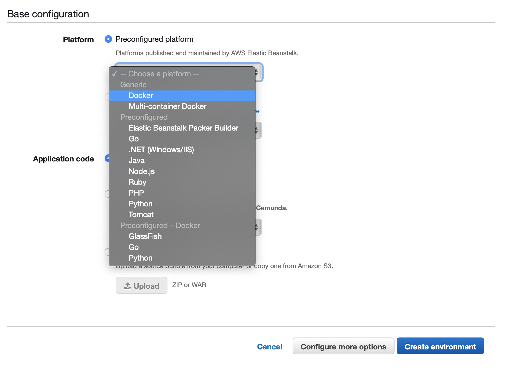

1. ## [Configure beanstalk](https://public.3.basecamp.com/p/SWkTxHda8XhiCackzJAynK3e)

    Choose docker as  platform.
    

2. ## Add ENV Variables to the beanstalk env
    * DB_TYPE : Type of database (mysql, postgres, mariadb, mssql or sqlite)
    * DB_HOST : Hostname or IP of the database
    * DB_PORT : Port of the database
    * DB_USER : Username to connect to the database
    * DB_PASS : Password to connect to the database
    * DB_NAME : Database name

3. ## Setup SSL certificates with nginx
    Modify the [.ebextensions/ssl.config](.ebextensions/ssl.config) to point to the right s3 bucket and certificates.
    variable need to be updated:
        1. <bucket>
        2. <ssl>
        3. <domain>

4. ##  commit the code and deploy

## Reference

* https://docs.requarks.io/install/docker